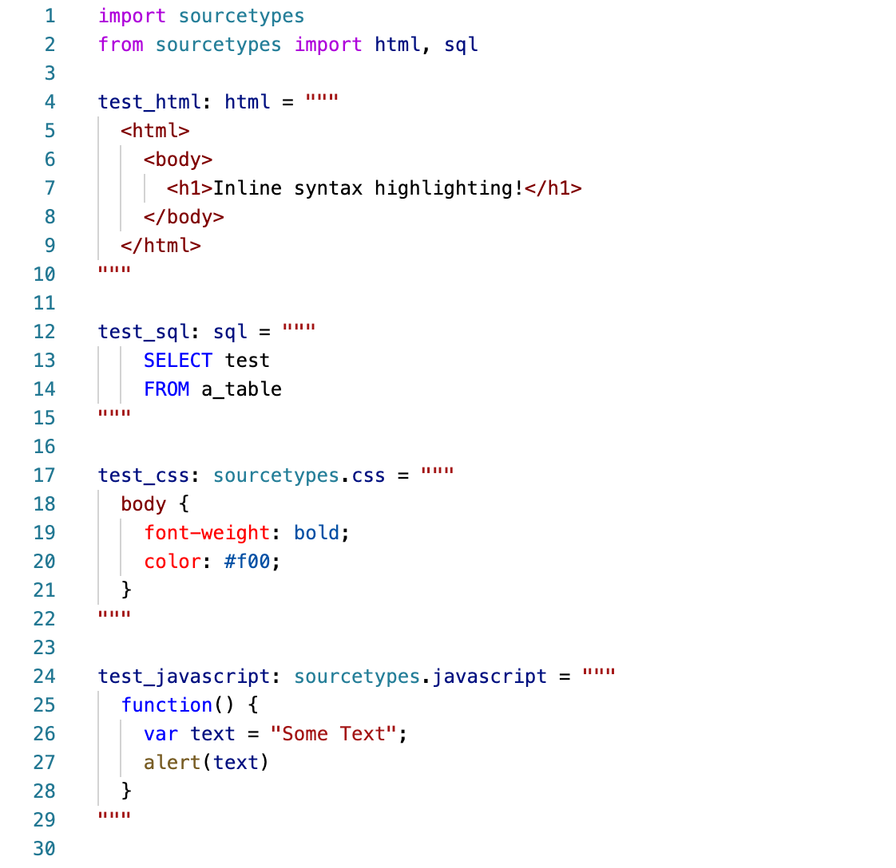

# Python Source Code Types For Inline Syntax Highlighting

Type annotations for various languages, when applied to multi line strings will syntax 
highlighting with the `python-inline-source` VS Code plugin.

Supports `html`, `css`, `javascript`, `typescript`, `sql`, `graphql`, 
multiple *css extension languages*, *template languages* and many more, 
[see below](#supported-languages) for a full list.

Uses [typing.Annotated](https://docs.python.org/3/library/typing.html#typing.Annotated)
to annotate the `str` type with the language used. You can use 
[typing.get_type_hints](https://docs.python.org/3/library/typing.html#typing.get_type_hints) 
at runtime to determine the language that a string has been annotated with.

## Installation

```
pip install sourcetypes
```

## Example

[](docs/examples.py)

## Usage

Use a type decoration named for language that you are using:

```
import sourcetypes

my_html_string: sourcetypes.html = """
  <h1>Some HTML</h1>
"""
```

or:

```
from sourcetypes import html

my_html_string: html = """
  <h1>Some HTML</h1>
"""
```

## Supported Languages

- `markdown` (aliased as `md`)
- `html`
- `django_html` (aliased as `django`)
- `django_txt`
- `jinja`
- `jinja_html`
- `css` (aliased as `style`, and `styles`)
- `scss`
- `less`
- `sass`
- `stylus`
- `javascript` (aliased as `js`)
- `jsx` (aliased as `javascriptreact`, and `react`)
- `typescript` (aliased as `ts`)
- `tsx` (aliased as `typescriptreact`)
- `coffeescript` (aliased as `coffee`)
- `sql`
- `json`
- `yaml`
- `graphql`
- `xml`
- `python`

## Release Notes

### [0.0.2] - 2022-03-13
- Doc tweaks

### [0.0.1] - 2022-03-11
- Alpha release